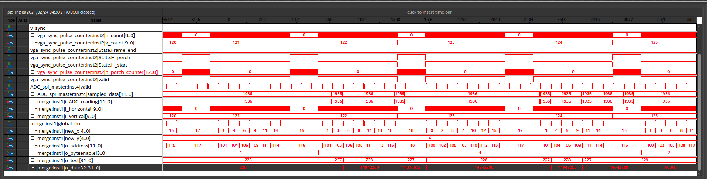

# RTR710_final_part1
 Samples analog VGA signal, counts horizontal and vertical sync pulses. Input 800x600, output 25x20 pixels. Input clk is 40 MHz for each entity.
 
 Part1 of final project consists of 3 parts:
 
 **1) ADC controller**
    SPI master that controlls DE0-Nano on board LTC2308. ADC_CONVST (conversion start or chip enable) should be high for ~1.5 us for ADC to start working, 0.5 us for pushing configuration bits to ADC and recieving 12 bits of sampled data. Each 2 us we get 12 bits of data. Outputs valid = '1' when 12 outputs bits are ready.
    
 **2) VGA sync pulse counter**
    Goal of this module is to output current location of VGA pixel. Horizontal counter increments on rising edge of 40 MHz clk (same clock is used for 800x600@60 VGA), each horizontal sync pulse increments vertical counter and each vertical sync pulse resets both counters. Module takes into account back porch of both sync signals. Also outputs valid = '1' when we are in visible region of frame.
    
  **3) Merge**

